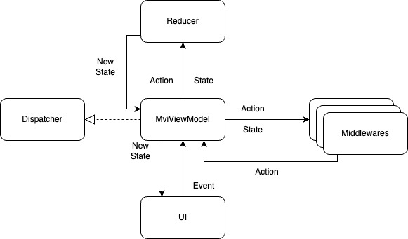

# MVI

The UI architecture of choice is MVI. This module implements a custom MVI framework to use whenever a new UI feature is
created.

## MVI Architecture

The following diagram displays the general MVI architecture.

UDF explanation:

- **UI** that observes a **state**.
- **UI interactions** that produce **actions**.
- One or more **side-effects** **may** be triggered by an **action**.
- The **result** of the process is **reduced** to a new **state**.
- The **UI** receives the **new state**.

## MVI Framework

This project implements a custom MVI framework, shown in the following diagram:

These are the framework's classes, their goal and usage:
| Class | Description | Usage |
| ---------------------------------------------------------------------------------------------- | -------------------------------- | ------------------------------------------------------------------------- |
| [Action](src/main/kotlin/com/houlis/haris/pictrfindr/ui/common/mvi/Action.kt)   | An action in the MVI framework. | A `sealed interface` should implement this marker `interface`. |
| [State](src/main/kotlin/com/houlis/haris/pictrfindr/ui/common/mvi/State.kt)     | State in the MVI framework. | A `sealed interface` should implement this `interface`. |
| [Dispatcher](src/main/kotlin/com/houlis/haris/pictrfindr/ui/common/mvi/Dispatcher.kt)     | Its role is to notify the MVI framework's components that a new `Action` needs to be processed. | The `MVIViewmodel` (and consequently every `ViewModel`) plays the role of `dispatch`ing new `Action`s. |
| [Reducer](src/main/kotlin/com/houlis/haris/pictrfindr/ui/common/mvi/Reducer.kt) | Reducer for a specific screen. This code runs in the **Main Thread** so it should **not** contain long running operations. | A class should implement this `interface` and generate a new `State` based on the `Action` and the previous `State`. |
| [MviViewModel](src/main/kotlin/com/houlis/haris/pictrfindr/ui/common/mvi/MviViewModel.kt) | This class is the core of the MVI framework. It notifies the `Reducer`s and the `Middleware`s when an `Action` is performed and exposes the observable `State` for the UI. | Every `ViewModel` should inherit from `MviViewModel`. |
| [Middleware](src/main/kotlin/com/houlis/haris/pictrfindr/ui/common/mvi/Middleware.kt) | A `Middleware` can handle `async` tasks whenever an `Action` happens in the MVI framework. Each `Middleware` has a `Dispatcher` and a `CoroutineScope`.    You can add any number of necessary `Middleware`s to the `ViewModel` as necessary. A `Middleware` is responsible for handling any `Action`s of interest (i.e. those that require a side-effect) and `dispatch` (through its `dispatcher`) the result of them wrapped in a different `Action`.   Together with the `MVIViewModel`, they are the **heart** of the _MVI framework_. | A `class` should extend this `abstract class`. |
